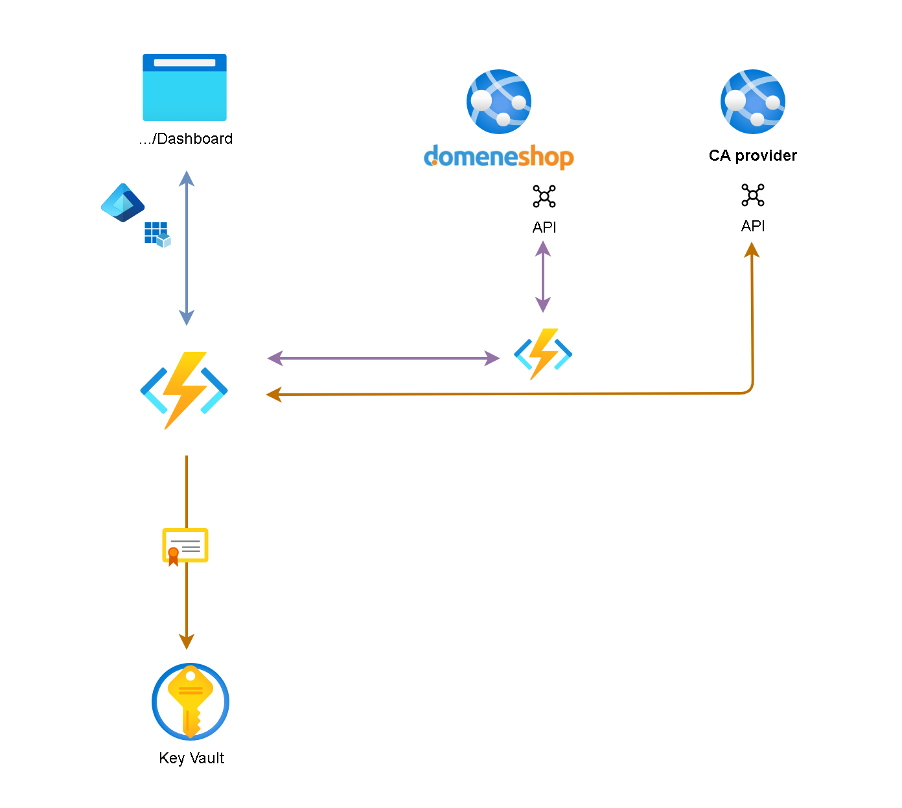
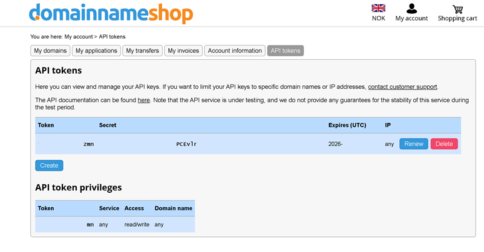

# AcmeBot Custom DNS Provider for Domeneshop

This Azure Function App implements a Custom DNS Provider for KeyVault-AcmeBot by Shibayan that interfaces with the Domeneshop API.

Inspired by:
- https://github.com/shibayan/keyvault-acmebot/
- https://github.com/Yavari/Acmebot.Provider.Loopia
- https://github.com/domeneshop/python-domeneshop
- https://github.com/eloekset/keyvault-acmebot/tree/feature/DomeneShop
  
- https://github.com/shibayan/keyvault-acmebot/pull/492



## Configurations

#### 1. Deploy https://github.com/shibayan/keyvault-acmebot as you prefer 

#### 2. Provisioning a Azure Function-app for AcmeBot.Domeneshop.provider as you prefer.

#### 3. Deploy AcmeBot.Domeneshop.provider `src`-folder to the Azure Function-app

#### 3. Login [Domenehop.no/admin?view=api](https://www.domeneshop.no/admin?view=api)
- Create token and secret
  


#### 4. In AcmeBot.Domeneshop.provider function app, set the following Enviroment variable to connect to Domeneshop API:
- `DOMENESHOP_TOKEN`: Your Domeneshop API token
- `DOMENESHOP_SECRET`: Your Domeneshop API secret

#### 5. Configure shibayan/keyvault-acmebot Environment Variable for CustomDNS that points to AcmeBot.Domeneshop.provider

- `Acmebot:CustomDns:Endpoint` = `domeneshop-func-app-api-url/api`
- `Acmebot:CustomDns:ApiKey` = `domeneshop-func-app-default-key`
- `Acmebot:CustomDns:ApiKeyHeaderName` = `x-functions-key`
- `Acmebot:CustomDns:PropagationSeconds` = `60`

"Advanced Edit"
```json
  {
    "name": "Acmebot:CustomDns:ApiKey",
    "value": "domeneshop-func-app-key",
    "slotSetting": false
  },
  {
    "name": "Acmebot:CustomDns:ApiKeyHeaderName",
    "value": "x-functions-key",
    "slotSetting": false
  },
  {
    "name": "Acmebot:CustomDns:Endpoint",
    "value": "https://domeneshop-func-app-url/api/",
    "slotSetting": false
  },
  {
    "name": "Acmebot:CustomDns:PropagationSeconds",
    "value": "60",
    "slotSetting": false
  }
  ```

#### 5. Use the dashboard and test it out.